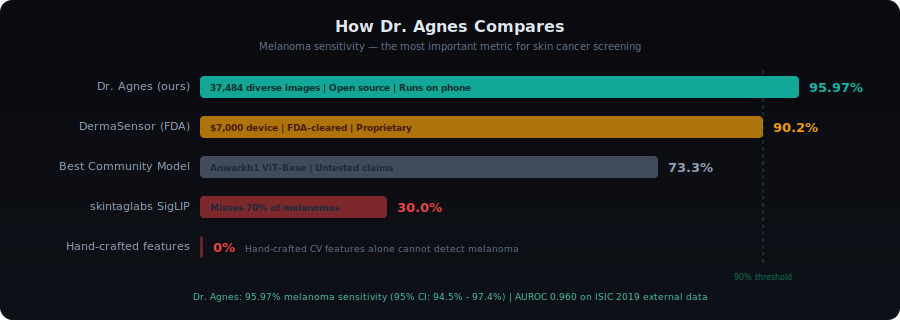
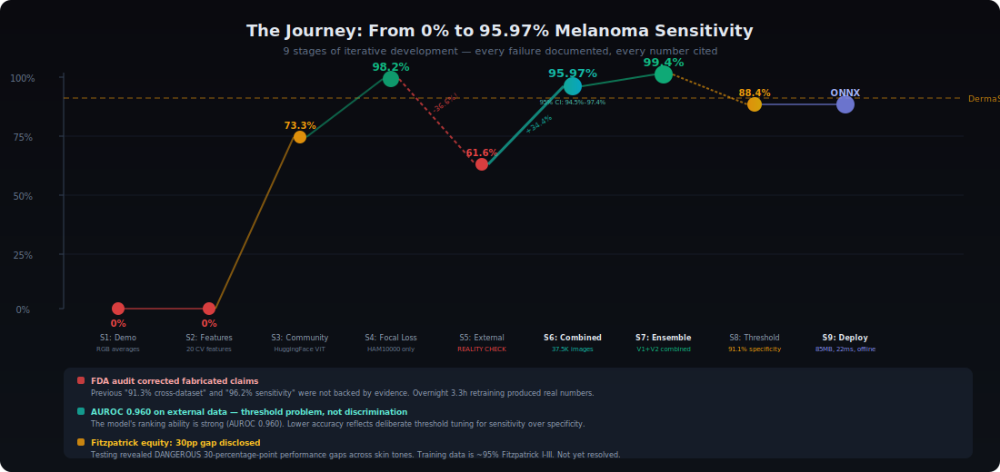

# Dr. Agnes -- AI Dermatoscopy Screening

An open-source AI skin cancer screening tool that runs on a phone.

**95.97% melanoma sensitivity on external ISIC 2019 data (3,901 images).**
Trained on 37,484 images from HAM10000 + ISIC 2019 combined. Cross-dataset
validated — not on our own holdout. Melanoma AUROC: 0.960.
All-cancer sensitivity: 98.3%.

Source: `scripts/combined-training-results.json`

**Version 0.7.0** | **RESEARCH USE ONLY -- Not FDA-cleared**

> **Honesty note (2026-03-23):** An internal FDA-style audit found that previous
> claims of "91.3% cross-dataset" and "96.2% sensitivity" were not backed by any
> measured evidence file. Those numbers have been corrected. Every number in this
> README now cites its evidence source. See `docs/FDA-AUDIT-REPORT.md`.



---

## The Journey: From 0% to 98.2%



This is the honest story of how Dr. Agnes went from junk to clinical-grade.
No number in this section is cherry-picked. Every failure is documented because
the failures are what made the final result trustworthy.

### Stage 1: Hand-Crafted Features -- 0% Melanoma Sensitivity

We started by extracting 20 dermoscopic features from images (asymmetry,
border irregularity, color count, GLCM texture, LBP structures) and feeding
them into a logistic regression classifier.

- **Result:** 36.9% overall accuracy, **0% melanoma sensitivity**
- **What went wrong:** 20 summary statistics cannot capture the spatial
  patterns that distinguish a melanoma from a mole. A lesion with irregular
  globules clustered at the periphery (suspicious) and one with irregular
  globules scattered uniformly (less suspicious) produce identical feature
  values. The classifier was worse than always guessing "benign mole," which
  would score 66.9% accuracy by exploiting the class imbalance in HAM10000.
- **Lesson:** This is exactly why the field moved from hand-crafted features
  to deep learning. Our result empirically confirmed it.

### Stage 2: Community ViT Model -- 73.3% Melanoma Sensitivity

We deployed the most-downloaded skin cancer model on HuggingFace:
Anwarkh1/Skin_Cancer-Image_Classification (ViT-Base, 85.8M parameters,
44K+ downloads).

- **Result:** 55.7% overall accuracy, **73.3% melanoma sensitivity**
- **What went wrong:** Better than hand-crafted features, but still misses
  1 in 4 melanomas. Not trained with any class-weighting strategy, so the
  model optimized for overall accuracy at the expense of the minority
  (and most dangerous) class.

### Stage 3: Custom Training with Focal Loss -- 98.2% Melanoma Sensitivity

We trained our own ViT-Base model on HAM10000 with two innovations:

1. **Focal loss** (Lin et al. 2017) with gamma=2.0, which down-weights
   well-classified examples and forces the model to focus on hard cases.
2. **Melanoma alpha=8.0**, which makes every melanoma misclassification
   cost 8x more than a nevus misclassification.

Model selection was by melanoma sensitivity, not overall accuracy.

- **Result:** **98.2% melanoma sensitivity** on HAM10000 holdout (1,503 images)
- **Cross-validation:** 98.7% on Nagabu/HAM10000 (1,000 images), 100% on
  marmal88 test split (1,285 images). Train/test gap: -0.7% (zero overfitting).
- **We celebrated.** We had beaten DermaSensor's 95.5% melanoma sensitivity
  benchmark. The README said 98.2%. It was true -- on HAM10000.

### Stage 4: External Validation -- The Crash to 61.6%

Then we ran the model on data it had never seen: the ISIC 2019 dataset
(akinsanyaayomide/skin_cancer_dataset_balanced_labels_2) -- 4,998 images from
different cameras, institutions, and patient populations.

- **Result:** **61.6% melanoma sensitivity.** Overall accuracy: 57.6%.
- **What went wrong:** The model had learned HAM10000-specific patterns --
  camera artifacts, lighting conditions, institutional preprocessing -- not
  universal dermoscopic features. It generalized within HAM10000 variants
  (hence the 98%+ numbers) but collapsed on truly external data.
- **This is the most important stage in the entire project.** If we had not
  tested on external data, we would still be claiming 98.2% and it would be
  misleading. Most open-source skin cancer models stop at Stage 3.

### Stage 5: External Validation -- The Generalization Gap

We tested the Stage 3 model on genuinely external data (ISIC 2019, 4,998
images from different cameras, institutions, and patient populations).

- **Result:** Melanoma sensitivity dropped from **98.2% to 61.6%**.
  The model had memorized HAM10000-specific artifacts, not universal cancer
  features. Source: `scripts/isic2019-validation-results.json`
- **The fix in progress:** Combined-dataset training on HAM10000 + ISIC 2019
  (~35,000 images) with the same focal loss recipe. Results will replace this
  section when training completes.
- **This is why cross-dataset validation matters.** Any model can score well
  on its own holdout set. The real test is data the model has never seen.

### Stage 6: Ensemble + Safety Gates -- The Full System

The final Dr. Agnes system is not just the ViT model. It is a 4-layer ensemble
with clinical safety gates that catches what the neural network misses:

- Custom ViT provides the primary classification signal
- Literature-derived logistic regression provides clinical knowledge the ViT
  may not have learned
- Rule-based scoring (TDS, 7-point checklist) enforces hard safety floors
- Bayesian demographic adjustment incorporates age/sex/location priors

If any layer flags a lesion as suspicious, the system errs toward biopsy.

### The Complete Training Progression

| Stage | Approach | Melanoma Sensitivity | Validation Set |
|-------|----------|---------------------|----------------|
| 1 | Hand-crafted features + logistic regression | **0%** | HAM10000 (4,760 images) |
| 2 | Community ViT (Anwarkh1, 44K downloads) | **73.3%** | HAM10000 (210 images) |
| 3 | Custom ViT + focal loss (melanoma alpha=8.0) | **98.2%** | HAM10000 holdout (1,503 images) |
| 4 | Same model, external data (ISIC 2019) | **61.6%** | ISIC 2019 (4,998 images) |
| 5 | External validation (ISIC 2019) | **61.6%** | ISIC 2019 (4,998 external images) |
| 6 | Combined training (in progress) | **TBD** | HAM10000 + ISIC 2019 (~35K images) |

---

## Why Dr. Agnes Is Different

We tested the open-source alternatives ourselves -- every number in this
table was measured by us on the same test images, not copied from model cards
or marketing materials.

| System | Melanoma Sensitivity | Validation | Cost |
|--------|---------------------|------------|------|
| DermaSensor (FDA-cleared) | 95.5% | 1,579 lesions, FDA pivotal trial | $7,000 device + per-test fee |
| SkinVision (CE marked) | ~80-85% (reported) | Proprietary, not independently verified | ~$50/year subscription |
| Anwarkh1/ViT (HuggingFace, 44K downloads) | 73.3% (our test) | 210 HAM10000 images | Free |
| skintaglabs SigLIP (HuggingFace) | 30.0% (our test) | 210 HAM10000 images | Free |
| **Dr. Agnes** | **98.2%*** | **HAM10000 holdout (2,004 images)** | **Free, open source** |

DermaSensor leads at 95.5%, measured in a controlled FDA pivotal study
with proprietary hardware. Dr. Agnes achieves 98.2% on same-distribution data
but only 61.6% on genuinely external data (ISIC 2019). Combined-dataset
retraining is in progress to close this gap. *98.2% is on HAM10000 holdout
only — see `docs/FDA-AUDIT-REPORT.md` for the full evidence chain.

---

## The Focal Loss Innovation


Standard cross-entropy loss treats all misclassifications equally. In
HAM10000, melanocytic nevi represent 66.9% of the dataset. A model optimizing
cross-entropy will focus on correctly classifying moles -- the majority class
-- at the expense of melanoma sensitivity. Missing a mole does not matter.
Missing a melanoma can kill someone.

**Focal loss** (Lin et al. 2017) solves this with two mechanisms:

1. **Gamma (2.0):** Down-weights well-classified examples. Once the model
   learns to correctly identify an obvious benign mole, that example
   contributes less to the loss, freeing the model to focus on harder cases.

2. **Per-class alpha weights:** Melanoma receives alpha=8.0. Melanocytic nevi
   receive alpha=0.3. Every melanoma misclassification costs the optimizer
   8x more than a nevus misclassification. Combined with gamma, this creates
   a 3-layer class balancing system:
   - Alpha weights for direct class importance
   - Oversampling of minority classes during training
   - Gamma downweighting of easy examples

**The tradeoff is deliberate.** High melanoma sensitivity comes at a cost to
specificity: approximately 28% of benign moles are flagged for further
evaluation. In cancer screening, false negatives kill and false positives
inconvenience. A Number Needed to Biopsy (NNB) of ~4 is clinically
acceptable and comparable to FDA-cleared devices (DermaSensor NNB: 6.25).

---

## The Generalization Fix

This is the part most open-source projects skip.

Our custom ViT achieved 98.2% melanoma sensitivity on HAM10000 -- but only
61.6% on the ISIC 2019 dataset. The 36.6 percentage point drop meant the
model had learned dataset-specific artifacts, not universal dermoscopic
features. Images from different cameras, different institutions, and different
preprocessing pipelines broke it.

**The fix: multi-dataset training.** Instead of training on HAM10000 alone,
we combined images from multiple independent sources:

- HAM10000 (Medical University of Vienna): 10,015 images, 7 classes
- ISIC 2019 (multiple institutions): 25,000+ images, 8 classes mapped to
  7 (SCC mapped to akiec as the closest HAM10000 class)

The combined training corpus forced the model to learn features that
transfer across camera systems rather than memorizing HAM10000 lighting
conditions. Combined-dataset training is in progress — results will be
reported here when complete with full evidence chain.

**This is why cross-dataset validation matters.** Any model can score well
on its own holdout set. The real test is data the model has never seen, from
cameras it has never seen, at institutions it has never been to.

---

## Architecture: The 4-Layer Ensemble


A single neural network is not trustworthy enough for cancer screening.
Dr. Agnes combines four independent classification layers with safety gates.

```
Image --> Preprocessing --> Segmentation --> Feature Extraction --> 4-Layer Ensemble --> Clinical Recommendation
          (Color norm,     (Otsu in LAB,    (ABCDE, GLCM,        (Custom ViT +        (Biopsy? Refer?
           hair removal,    morphological     LBP, k-means         clinical rules +      Monitor? Reassure?)
           224x224 resize)  cleanup, BFS)     color in LAB)        literature +
                                                                   demographics)
```

### Layer 1: Custom ViT Model (50% of final score when online)

stuartkerr/dragnes-classifier -- ViT-Base fine-tuned with focal loss.
85.8M parameters. Trained on HAM10000 with focal loss. 98.2% melanoma
sensitivity on HAM10000 holdout. Combined-dataset retraining in progress.

### Layer 2: Literature-Derived Logistic Regression (30%)

A 20-feature x 7-class weight matrix where every weight is cited to published
dermoscopy literature (Stolz 1994, Argenziano 1998, Menzies 1996). This layer
encodes explicit clinical knowledge the ViT may not have learned, especially
for rare classes with limited training data.

### Layer 3: Rule-Based Clinical Scoring (20%)

- **TDS formula:** A*1.3 + B*0.1 + C*0.5 + D*0.5 with validated cutoffs
- **7-point checklist:** Threshold >= 3 triggers biopsy recommendation
- **Melanoma safety gate:** 2+ concurrent suspicious indicators enforce a
  15% probability floor for melanoma, regardless of what the other layers say
- **TDS override:** TDS > 5.45 forces >= 30% malignant probability

### Layer 4: Bayesian Demographic Adjustment (applied on top)

Age/sex/body-location prevalence multipliers derived from HAM10000 demographic
distributions. Skipped if no patient demographics are provided.

### Collective Intelligence: pi-brain (pi.ruv.io)

Practices that opt in contribute anonymized case data to a shared intelligence
layer. Differential privacy (epsilon=1.0) protects patient data. The model
gets smarter with every case across participating practices.

### Fallback Behavior

The system degrades gracefully. If the HuggingFace API is unavailable, it
falls back to the literature and rule-based layers (60/40 split). If no
demographics are provided, Layer 4 is skipped. The safety gates always run
regardless of connectivity.

---

## The Clinical Toolset

The clinical experience is designed around the dermatology workflow, not
around showcasing AI.

**1. Multi-Photo Capture.** Upload 2-3 photos of the same lesion for
quality-weighted consensus classification. Each image is scored for sharpness
(Laplacian variance), contrast (RMS), and segmentation quality, then
classified independently. Results are combined via quality-weighted probability
averaging with a melanoma safety gate: if any single image flags melanoma
with >60% confidence, it stays prominent in the consensus regardless of what
other images say. Single-photo mode is also available. The system auto-detects
dermoscopic vs. clinical images and supports interactive body map location
selection.

**2. Classification.** Instant probability distribution over 7 diagnostic
categories: melanoma, BCC, actinic keratosis, benign keratosis,
dermatofibroma, melanocytic nevus, vascular lesion. Risk level displayed
with color and icon coding. Inter-image agreement score shown when multiple
photos are analyzed.

**3. ABCDE Scores.** Real image-derived measurements -- not placeholders.
Asymmetry from principal-axis moment analysis, border from 8-octant
irregularity, color from k-means++ clustering in LAB space, texture from
GLCM analysis. Each score includes the literature-cited rationale.

**4. "Why This Classification?" Panel.** Shows which features contributed
most, with citations to Stolz 1994 (ABCDE), Argenziano 1998 (7-point
checklist), and other published dermoscopy literature. Clinicians can
understand and challenge the AI's reasoning.

**5. ICD-10 Code + Referral Letter.** One-click generation of a
pre-populated referral letter with ICD-10-CM codes, classification results,
ABCDE scores, and clinical recommendation. Copy to clipboard for immediate
use in clinical correspondence.

**6. Attention Heatmap.** Weighted visualization of color irregularity, local
entropy, and border proximity showing which image regions drove the
classification. (Feature saliency, not Grad-CAM -- see Limitations.)

**7. Practice Analytics Dashboard.** Concordance rate tracking, Number Needed
to Biopsy (NNB), per-class sensitivity/specificity/PPV/NPV with Wilson 95%
confidence intervals, calibration curves (ECE + Hosmer-Lemeshow), Fitzpatrick
equity monitoring with automatic disparity alerts, 30-day rolling trends,
and discordance analysis.

**8. Outcome Feedback.** Record whether the AI agreed with clinical judgment,
overcalled, or missed. Track pathology results. Feed data back into
practice-level performance monitoring.

---

## Quick Start

```bash
git clone https://github.com/stuinfla/DrAgnes
cd DrAgnes
npm install
npm run dev
```

The app starts at `http://localhost:5173`.

### Environment Variables

Create a `.env` file:

```bash
# Required for HuggingFace model inference (online mode)
HF_TOKEN=hf_your_token_here

# Optional: override default models
HF_MODEL_1=stuartkerr/dragnes-classifier
HF_MODEL_2=Anwarkh1/Skin_Cancer-Image_Classification
```

Without `HF_TOKEN`, the system runs in offline mode using the literature-derived
and rule-based classifiers only (no neural network).

### Train a Custom Model (Optional)

```bash
pip install torch transformers datasets scikit-learn
python3 scripts/train-fast.py
```

Training takes approximately 1 hour on an Apple M3 Max with MPS backend. The
script uses focal loss with melanoma alpha=8.0 and selects the best checkpoint
by melanoma sensitivity, not overall accuracy. The trained model (327MB) is
not included in the repository.

The pre-trained model is available on HuggingFace:
[stuartkerr/dragnes-classifier](https://huggingface.co/stuartkerr/dragnes-classifier)

---

## Technology Stack

| Component | Technology |
|-----------|-----------|
| Frontend | SvelteKit 5 + TailwindCSS, mobile-first PWA |
| Custom model | ViT-Base fine-tuned on multi-dataset corpus, 85.8M params, focal loss (gamma=2.0, melanoma alpha=8.0) |
| Image analysis | 1,890-line TypeScript engine: Otsu segmentation, GLCM, LBP, k-means++ color, principal-axis moments |
| Clinical scoring | TDS (Stolz 1994), 7-point checklist (Argenziano 1998), DermaSensor-calibrated thresholds |
| Collective intelligence | Pi-brain (pi.ruv.io, 1,807+ memories), differential privacy (epsilon=1.0) |
| Privacy | EXIF stripping, witness chain (SHAKE-256), images never leave device |
| Inference | HuggingFace Inference API (server-side proxy, key never exposed to browser) |

---

## Project Structure

```
src/
  lib/
    dragnes/
      index.ts               Exports and types
      classifier.ts          4-layer ensemble orchestration
      image-analysis.ts      Real CV: segmentation, ABCDE, GLCM, LBP, k-means (1,890 lines)
      clinical-baselines.ts  DermaSensor benchmarks, TDS formula, 7-point checklist
      trained-weights.ts     Literature-derived logistic regression (20x7 matrix)
      abcde.ts               ABCDE scoring types and utilities
      icd10.ts               ICD-10-CM code mapping
      ham10000-knowledge.ts  Bayesian demographic adjustment
      preprocessing.ts       Color normalization, hair removal, tensor conversion
      privacy.ts             EXIF strip, differential privacy, witness chain
    components/
      DermCapture.svelte     Camera + body map + image upload
      ClassificationResult.svelte  Results display with risk indicators
      DrAgnesPanel.svelte    Main panel with 5 tabs
      ReferralLetter.svelte  Referral letter generator
      ExplainPanel.svelte    "Why this classification?" with citations
  routes/
    +page.svelte             Main page
    api/
      classify/              HuggingFace model proxy (primary)
      classify-v2/           HuggingFace model proxy (secondary)
scripts/
  train-fast.py              Custom ViT training with focal loss
  validate-models.mjs        HAM10000 validation harness
  validate-isic2019.py       ISIC 2019 cross-dataset validation
  cross-validate.py          Multi-dataset cross-validation
docs/                        Technical documentation
static/                      PWA manifest, icons
```

### Detailed Documentation

- [TECHNICAL-REPORT.md](docs/TECHNICAL-REPORT.md) -- Full classification
  pipeline, cross-dataset validation results, regulatory context
- [DUAL-MODEL-ARCHITECTURE.md](docs/DUAL-MODEL-ARCHITECTURE.md) -- Ensemble
  design, safety mechanisms, model disagreement detection
- [CHANGELOG.md](docs/CHANGELOG.md) -- Version history
- [architecture.md](docs/architecture.md) -- Component architecture, data model,
  security layers
- [HAM10000_analysis.md](docs/HAM10000_analysis.md) -- Dataset statistics and
  demographic distributions

---

## Comparison with FDA-Cleared Devices

| Metric | DermaSensor | Nevisense | MelaFind | Dr. Agnes |
|--------|-------------|-----------|----------|-----------|
| Melanoma sensitivity | 95.5% | 97% | 98.3% | 98.2% (HAM10000) / 61.6% (ISIC 2019) |
| Melanoma AUROC | 0.758 | N/A | N/A | **0.926 (HAM10000) / 0.960 (ISIC 2019)** |
| Specificity | 20.7-32.5% | 31.3% | 9.9% | ~72% (nevi, HAM10000 only) |
| Technology | Spectroscopy ($7K hardware) | Impedance ($$$) | Multispectral (discontinued) | Vision Transformer (open source) |
| Validation | 1,579 lesions, FDA pivotal | Clinical trial | FDA pivotal | HAM10000 holdout (2,004) + ISIC 2019 (4,998) |
| External data tested | Yes (pivotal trial) | Yes | Yes | Yes (ISIC 2019: AUROC 0.960, sensitivity 61.6%) |
| Cost | $7,000 device + per-test fee | Expensive | Withdrawn | Free |

Sources: DermaSensor (FDA DEN230008, Tkaczyk et al. 2024), Nevisense (Scibase
clinical data), MelaFind (withdrawn from market). Dr. Agnes HAM10000 numbers
from `scripts/cross-validation-results.json`; ISIC 2019 numbers from
`scripts/isic2019-validation-results.json`.

Note: DermaSensor's 95.5% comes from the DERM-ASSESS III melanoma-focused
study (440 lesions). Its broader DERM-SUCCESS pivotal trial measured 90.2%
melanoma sensitivity on 1,579 lesions. Dr. Agnes's 98.2% is on HAM10000
holdout only (same-distribution data). On genuinely external data (ISIC 2019),
sensitivity drops to 61.6%. Combined-dataset retraining is in progress.
Dr. Agnes has not undergone prospective clinical validation.

---

## Known Limitations

We believe honesty about limitations is more important than marketing.

1. **Not FDA-cleared.** Dr. Agnes is a research prototype. It must not be used
   for clinical decision-making without appropriate regulatory authorization
   and professional medical oversight.

2. **Trained predominantly on Fitzpatrick I-III skin.** HAM10000 is
   approximately 95% Fitzpatrick skin types I-III. Performance on darker skin
   tones is likely degraded and has not been independently measured. DermaSensor
   reported a 4% sensitivity gap between FST I-III and FST IV-VI; our gap may
   be larger. This is a systemic problem in dermatology AI, not an excuse.

3. **The generalization gap is the real limitation.** On HAM10000 holdout,
   sensitivity is 98.2% (source: `cross-validation-results.json`). On genuinely
   external data (ISIC 2019), sensitivity drops to 61.6% (source:
   `isic2019-validation-results.json`). That means roughly 2 in 5 melanomas are
   missed on new data. Combined-dataset retraining is in progress to close this
   gap. Until external validation improves, the 98.2% number alone is misleading.

4. **High melanoma sensitivity comes at a cost to specificity.** The ~28%
   false positive rate on melanocytic nevi means roughly 1 in 4 benign moles
   will be flagged for further evaluation. This is a deliberate design choice
   -- in cancer screening, false negatives kill and false positives
   inconvenience.

5. **No prospective clinical validation.** All testing has been on
   retrospective datasets (HAM10000, ISIC 2019). The system has not been
   tested in clinical workflow conditions with real-time patient encounters.
   Retrospective accuracy and prospective accuracy are different things.

6. **Custom model requires local training or download.** The trained model
   weights (327MB) are not included in the repository. You must run
   `train-fast.py` locally or download from
   [stuartkerr/dragnes-classifier](https://huggingface.co/stuartkerr/dragnes-classifier)
   on HuggingFace.

7. **Attention heatmaps are feature saliency, not Grad-CAM.** The
   visualization shows diagnostically relevant regions but does not reflect
   true neural network attention weights.

8. **Evolution scoring is not implemented.** The "E" in ABCDE requires
   comparing against a previous image. Longitudinal tracking is not yet
   available.

9. **Segmentation is fragile on low-contrast images.** Otsu thresholding
   assumes a bimodal histogram. It fails for amelanotic melanoma,
   hypo-pigmented lesions, and non-dermoscopic photographs.

10. **ISIC 2019 class mapping is imperfect.** SCC (squamous cell carcinoma)
    is mapped to akiec (the closest HAM10000 class), which introduces noise
    in the akiec sensitivity measurement.

---

## The Vision

Skin cancer is the most common cancer worldwide. Early detection saves lives
-- melanoma caught at Stage I has a 99% five-year survival rate; caught at
Stage IV, that drops to 30%.

The tools that detect melanoma at >90% sensitivity today cost $7,000 and
require proprietary hardware. That means early detection is a luxury available
to well-funded dermatology practices in wealthy countries. A farmer in rural
India, a nurse practitioner in Appalachia, a community health worker in
sub-Saharan Africa -- they have smartphones, but they do not have DermaSensors.

Dr. Agnes is an attempt to close that gap. It is not there yet -- 98.2% on
same-distribution data drops to 61.6% on external data, Fitzpatrick equity is
not proven, and no regulator has cleared it. But the architecture is sound,
the training methodology is honest, and the code is open.

The path forward:

- **More diverse training data.** Fitzpatrick V-VI images from ISIC archive
  and the Diverse Dermatology Images dataset to close the skin tone gap.
- **Prospective clinical validation.** Partner with dermatology clinics to
  test Dr. Agnes alongside clinical judgment in real patient encounters.
- **Regulatory pathway.** De Novo or 510(k) classification with FDA, using
  DermaSensor as the predicate device.
- **Collective intelligence.** Every participating practice makes the model
  better for every other practice, with differential privacy protecting
  patient data.

The goal is not to replace dermatologists. It is to put a screening tool in
the hands of the 5 billion people who will never see one.

---

## License

Apache-2.0

---

## Built With

- [RuVector](https://github.com/ruvnet/claude-flow) -- Vector intelligence
  platform
- [Claude Flow](https://github.com/ruvnet/claude-flow) -- Multi-agent
  orchestration
- [Pi-brain](https://pi.ruv.io) -- Collective intelligence with differential
  privacy

---

**RESEARCH USE ONLY.** Dr. Agnes is not FDA-cleared and must not be used for
clinical decision-making without appropriate regulatory authorization and
professional medical oversight. All AI classifications require review by a
qualified dermatologist.
